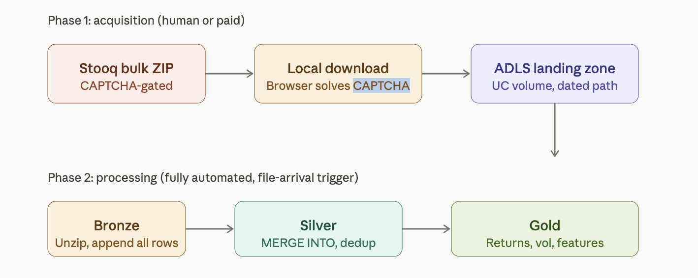

# How to Access Stooq Data on Databricks Free Edition

Stooq provides bulk historical data downloads at `stooq.com/db/h/`, but these downloads require a CAPTCHA. This means you cannot reliably use `wget` or `curl` to download the bulk ZIP files programmatically without human interaction.

## Approach: Using Stooq Bulk Data on Databricks Free Edition

1. Manually solve the CAPTCHA and download the bulk historical data for the US region.
2. Upload the ZIP file to a Unity Catalog volume.
3. Run PySpark code in a Databricks Free Edition notebook to:
   - Unzip the archive on the driver.
   - Work with the Stooq directory tree, for example:

     ```text
     data/daily/us/nasdaq stocks/.../aapl.us.txt
     ```

   - Read each file as a CSV with headers similar to:

     ```text
     <TICKER>,<PER>,<DATE>,<TIME>,<OPEN>,<HIGH>,<LOW>,<CLOSE>,<VOL>,<OPENINT>
     ```

   - Move extracted files into a Unity Catalog volume so Spark can read them.
   - Perform a single Spark read across thousands of `.txt` files, allowing Spark to parallelize the read.

## Drawbacks of This Approach

Databricks Free Edition has limited resources, so the following bottlenecks need to be considered when uploading and extracting the full Stooq bulk historical ZIP file. The US region bulk file is roughly 500 MB.

- ZIP extraction is mostly disk-bound, not memory-bound. It does not load the entire ZIP into RAM.
- Peak memory is roughly the size of the largest single file inside the archive.
- The main constraint on Free Edition is disk space on the driver's local filesystem, such as `/tmp`.
- Free Edition serverless compute has limited ephemeral local storage.
- A 500 MB ZIP that extracts to roughly 1.5–2 GB of CSV files may require around 2.5 GB free on `/tmp` to hold both the ZIP and the extracted files.
- There is a risk of `/tmp` running out of disk space.
- The driver can be OOM-killed if a memory-bound operation such as `.read()` loads the whole ZIP into a bytes object.
- However, Databricks Free Edition's SDK using w.files.upload_from() can become a bottleneck for 8,000 small local text files, mainly because it uploads one file per API call from local compute to the Databricks Unity Catalog Volume. It can take minutes rather than seconds.

## Common Workarounds for Getting Stooq Data Programmatically

### Option 1: Per-Ticker CSV Downloads

Stooq offers a different URL pattern for direct CSV downloads:

```text
https://stooq.com/q/d/l/?s=TICKER&d1=YYYYMMDD&d2=YYYYMMDD&i=d
```

For example, Apple daily data can be requested with:

```text
https://stooq.com/q/d/l/?s=aapl.us&d1=20200101&d2=20251231&i=d
```

This returns a plain CSV that can be fetched with an HTTP client. You only need to know the ticker symbol and download one stock at a time.

However, you may get an empty DataFrame or a redirect issue because Stooq may rate-limit requests or require a browser-like user agent. In that case, Python `requests` can be used first, followed by `pandas.read_csv`.

#### Recent Changes

- This now requires an API key that can be obtained by entering a CAPTCHA.
- Go to:

  ```text
  https://stooq.com/q/d/?s=AMZN.US&get_apikey
  ```

- Copy the download link URL and inspect it to get the API key.
- This approach can run locally.
- When run from a cloud server IP, such as a Databricks Free Edition notebook, it may return:

  ```text
  EmptyDataError: No columns to parse from file
  ```

  This happens because Stooq may block or rate-limit the request. Instead of returning CSV data, it returns an HTML page, likely a CAPTCHA challenge or an error page. As a result, empty data is returned when trying to read Stooq data into a pandas DataFrame.

### Option 2: Using `pandas_datareader`

`pandas_datareader` has built-in Stooq support. It works well for US stocks, often with the `.US` suffix, and many international stocks.

#### Recent Changes

- `pandas-datareader` is effectively abandoned. The last release was version `0.10.0`, released in July 2021.
- There has been no new release since then.
- Stooq has implemented API keys for downloading daily historical data for a single ticker.
- `pandas_datareader` builds the Stooq URL internally and does not support or accept an API key parameter for Stooq.

## Best Approach for Working With Stooq Data on Databricks Free Edition

Stooq blocks or throttles requests from cloud IP ranges such as AWS, Azure, and GCP. This is why direct CSV downloads can return blank data on Databricks Free Edition.

The most viable approach is:

1. Create a Unity Catalog volume once in Databricks using Spark SQL in Databricks notebook.
2. Install and Configure Databricks CLI authentication locally
3. Install Databricks SDK locally
4. Local Python script: download Stooq CSVs from per Ticker Stooq URL's and upload to volume using Databricks SDK (The SDK’s w.files.upload_from(...) is the recommended method for uploading from a local file path to a Unity Catalog volume.
5. Read uploaded CSV files in Databricks notebook, Apply the schema to the CSV ticker files and Save the data as a Delta table in the Bronze layer.

# How to Access Stooq Data in Production: Azure Databricks

If you need to use only Stooq data in production, consider the following approaches.

## Approach 1: Per-Ticker API Loops

### Networking

In Azure Databricks, you can control egress. Route traffic through a NAT Gateway with a static public IP that is allowed by Stooq. This avoids the blank CSV problem caused by noisy shared cloud IP ranges.

### Parameterization

Parameterize tickers and date ranges as job parameters using `dbutils.widgets` in the notebook.

### Concurrency

With seven tickers, a serial loop is fine. For hundreds or thousands of tickers, you should parallelize.

For example, if a single API call takes 2 seconds:

```text
2,000 tickers × 2 seconds = 4,000 seconds ≈ 67 minutes
```

Instead of looping over tickers on the driver, create a DataFrame of tickers, partition it across executors, and let each executor process its chunk in parallel.

A common pattern is to put the ticker list in a Spark DataFrame and use `mapInPandas` so each executor pulls one partition of tickers in parallel.

Example approach:

1. Create a Spark DataFrame from the ticker list and partition it, for example using `.repartition(8)`. Call it `tickers_df`.
2. Use `.mapInPandas(fetch_partition, schema=...)` on `tickers_df`.

   ```python
   prices_df = tickers_df.mapInPandas(fetch_partition, schema=output_schema)
   ```

3. Spark serializes `fetch_partition` and ships it to the executors. Each executor receives approximately `N / 8` tickers, calls Stooq for each ticker, and yields the resulting rows.
4. Spark stitches all yielded DataFrames together into one distributed DataFrame validated against `output_schema`.

### Orchestration

Wrap the ingestion in a Databricks Workflow, also known as a Job, on a schedule rather than running notebooks manually. Use a small job cluster instead of all-purpose compute.

### Storage Layout

Instead of overwriting one Delta table, use a medallion architecture:

- Raw CSV or JSON lands in Bronze, such as ADLS Gen2 via Unity Catalog volumes.
- Cleaned and typed data goes to Silver.
- Aggregates and features go to Gold.

Use `MERGE INTO` for incremental upserts so reruns do not duplicate rows.

### Avoid Free CSV Endpoints in Production

For production, it is better to license a proper market data feed such as Refinitiv, Bloomberg, Polygon.io, or EOD Historical Data.

Store API keys in Azure Key Vault and access them through a Databricks secret scope. Free scraping endpoints are a compliance and reliability liability in production.

## Approach 2: Stooq Bulk Data

This is the preferred approach for production batch processing.

### Human-in-the-Loop Download

For daily or weekly batches:

1. Solve the Stooq CAPTCHA and download the bulk ZIP file for US region from Stooq.
2. Land the ZIP in the Unity Catalog Volume or designated ADLS using Azure Storage Explorer or `azcopy`. 
3. When the Zipped Bulk data is dropped into ADLS, it lives in the volume from the start. It streams entries out of the ZIP via the volume path:
4. A Databricks Workflow with a file-arrival trigger automatically picks it up and runs the rest of the pipeline.

## Bulk Data Pipeline Diagram


